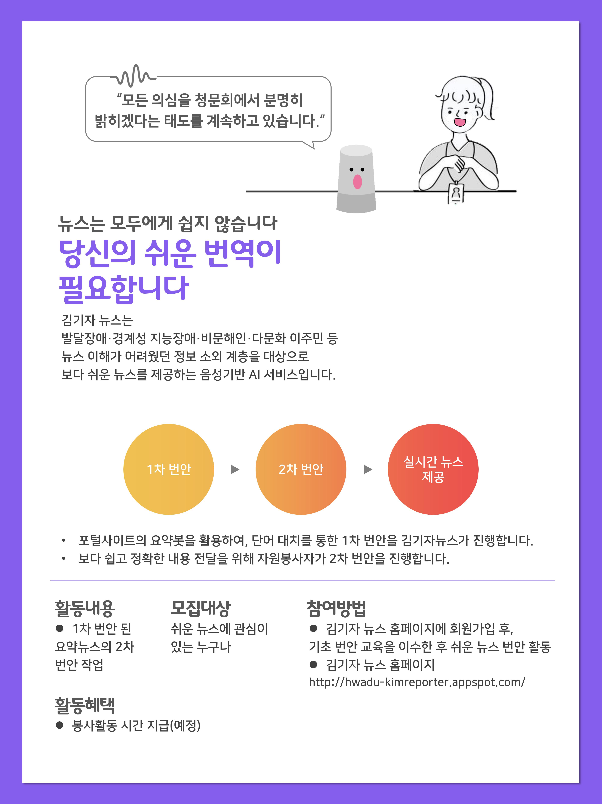

# 친절한 김기자 

<친절한 김기자>는 발달장애나 경계성 지능장애, 문해력이 낮은 비문해인, 이주민, 어린이 등 다양한 이유로 뉴스 이해가 어려웠던 정보 소외계층에게 포털사이트 뉴스를 요약하고, 쉽게 번안하여 읽어주는 서비스입니다.

**회사소개**

**누구플레이 연결 용 API**
1. **action.PlayNews**: 기본 발화에 대한 응답으로, 1위부터 5위까지의 뉴스를 틀어줍니다. 
2. **action.PlayNext1**: 다음 뉴스도 듣고 싶다고 답했을 때, 6위부터 10위까지의 뉴스를 틀어줍니다. 
3. **action.PlayNext2**: 다음 뉴스도 듣고 싶다고 답했을 때, 11위부터 15위까지의 뉴스를 틀어줍니다. 
4. **action.PlayNext3**: 다음 뉴스도 듣고 싶다고 답했을 때, 16위부터 마지막까지의 뉴스를 틀어줍니다. 
5. **action.PlayNum**: 선택한 뉴스를 틀고 싶다는 발화에 대해 응답합니다. 
6. **action.PlayOne**: 선택한 뉴스를 틀어줍니다.
7. **action.PlayMany**: 선택한 뉴스 틀어줍니다.
